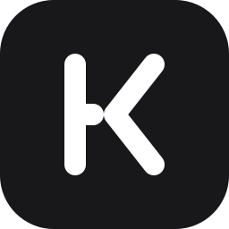

<div align="center">
  <a href="https://github.com/koamishin/KoamiStarterKit">
    <!-- Replace with actual logo URL if available, or keep using the text/emoji representation -->
    
  </a>

  <h1 align="center">Koamishin Starterkit</h1>

  <p align="center">
    <strong>The Opinionated Laravel Starter Kit for Modern Artisans</strong>
  </p>

  <p align="center">
    <a href="https://laravel.com"></a>
    <a href="https://vuejs.org"></a>
    <a href="https://inertiajs.com"></a>
    <a href="https://tailwindcss.com"></a>
    <a href="https://ui.shadcn.com"></a>
  </p>
</div>

<br/>

## 🚀 Why This Exists?

I've tried different starter kits—including the official Laravel starter kits. They're great, no doubt about it. But every time I started a new project, I found myself doing the same ritual over and over:

- Setting up authentication and user management
- Installing and configuring Filament for the admin panel
- Wiring up roles and permissions
- Adding activity logs, notifications, impersonation
- Setting up development dependencies, linters, and CI/CD

It wasn't a huge deal, but it added up. Hours lost on configuration instead of building actual features.

**So I built Koamishin Starterkit for myself.** One command, zero friction, and I'm straight into shipping features instead of fighting config files.

> **Note**: This starter kit is configured for **specific applications** rather than SaaS products. I don't primarily build SaaS applications, so the architecture and features reflect that use case. If I start working on SaaS-based projects in the future, I'll update this to support those needs.

---

## 🎯 Who Is This For?

This starter kit is for developers who:

- Want to skip the initial setup phase and get straight to building features
- Work on custom applications rather than multi-tenant SaaS products
- Appreciate having authentication, admin panels, and user management ready out of the box
- Prefer a curated, opinionated setup over making endless configuration decisions

Use it as-is, fork it, or cherry-pick the parts you like—whatever gets you coding faster.

## ✨ Features

**Battery-included, but not bloated.** Everything you need to ship.

- **🔐 Complete Authentication**: Powered by **Fortify**. Login, Registration, 2FA, Email Verification, Passkeys, and Profile Management ready to go.
- **🔑 Social Login**: Login with **GitHub**, **Google**, or **Facebook** via Laravel Socialite. Configure credentials through the admin panel (stored in DB or `.env`).
- **📦 Modular Architecture**: Built on **nwidart/laravel-modules** — extend with self-contained modules that register their own routes, Filament resources, and Inertia pages.
- **👥 Roles & Permissions**: Built-in **Spatie Permissions**. Manage **Admins** (Filament access) and **Users** (Inertia access) out of the box.
- **⚙️ System Settings**: Powerful settings management with **spatie/laravel-settings**. Configure application details, features, social login, and security through a beautiful Filament interface.
- **🎨 Auth Layout Switcher**: Choose between 3 beautiful authentication layouts (Simple, Card, Split) directly from the admin settings panel.
- **⌨️ User Activity Logs** Included with Activity Logs filament plugin to monitor user activities on the application
- **🕵️‍♂️ User Impersonation**: Admins can easily impersonate users to troubleshoot issues, with a visible banner and quick "Leave" action.
- **🔔 Database Notifications**: Built-in notification system with a bell icon in the sidebar header. Shows unread count, dropdown list, and mark as read functionality.
- **🎛️ Admin Panel**: Pre-configured **Filament** admin dashboard with User Management.
- **🎨 40+ UI Components**: Beautiful, accessible components from **Shadcn Vue**, plus dark mode and multiple themes (Default, Rose, Ocean, Sage Garden, Claude).
- **🛠️ Type-Safe Routing**: **Wayfinder** ensures your frontend knows your backend routes. No more broken links.
- **⚡ High Performance**: **Laravel Octane** + **Inertia.js v2** + **Vite** for instant page loads.
- **🚢 Production Ready**: **Docker** support, **GitHub Actions** CI/CD, and strict code quality tools (Pint, PHPStan, Rector) pre-configured.

---

## 🏁 Getting Started

### Prerequisites

- PHP 8.2+
- Composer
- Node.js & NPM/Bun

### Installation

You can create a new project using Composer:

```bash
composer create-project koamishin/koamistarterkit my-app
cd my-app
```

Or use laravel new command:

```bash
laravel new my-app --using=koamishin/koamistarterkit
```

### ⚙️ Setup & Configuration

Once installed, personalize the starter kit with your own project details using our setup wizard:

```bash
php artisan setup:starter-kit
```

This interactive tool will:

- 🎨 **Personalize** `composer.json` with your author and package details.
- 🐳 **Configure Docker** settings (Docker Hub vs GHCR).
- 🤖 **Update GitHub Actions** workflows to use your repository and registry.

### Development

Start the development server with one simple command:

```bash
composer run dev
```

This runs both the Laravel server and the Vite development server concurrently.

---

## 📦 What's Inside?

### UI Components (Shadcn)

This starter kit includes a comprehensive suite of UI components to jumpstart your development:

<details>
<summary><strong>Click to view all included components</strong></summary>

- **Form Elements**: Input, Select, Checkbox, Radio, Switch, Slider, Textarea, Form, Combobox
- **Feedback**: Alert, Badge, Progress, Skeleton, Sonner (Toast), Spinner, Tooltip
- **Overlay**: Dialog, Drawer, Sheet, Popover, Hover Card, Context Menu, Dropdown Menu
- **Layout**: Card, Aspect Ratio, Resizable, Scroll Area, Separator
- **Navigation**: Sidebar, Navigation Menu, Breadcrumb, Tabs, Menubar, Pagination, Stepper
- **Data Display**: Table, Avatar, Accordion, Collapsible, Carousel, Calendar
- **Charts**: Extensive charting library support

</details>

---

## 🔔 Using Notifications

This starter kit includes a database notification system integrated into the sidebar header. Users can view and manage their notifications from the bell icon.

### Sending Notifications

Send notifications to users using Laravel's notification system:

```php
use App\Models\User;
use App\Notifications\YourNotification;

$user->notify(new YourNotification());
```

### Creating Notifications

Create a new notification class:

```bash
php artisan make:notification YourNotification
```

In your notification class, define the database channel:

```php
public function via(object $notifiable): array
{
    return ['database'];
}

public function toArray(object $notifiable): array
{
    return [
        'title' => 'Notification Title',
        'message' => 'Your notification message here',
        'action_url' => '/optional-action-url',
    ];
}
```

---

## ⚙️ System Settings

This starter kit includes a comprehensive settings management system powered by **spatie/laravel-settings** with a beautiful Filament interface.

### Settings Sections

The settings are organized into logical sections accessible from the admin panel at `/admin/settings`:

<details>
<summary><strong>Application Details</strong></summary>

Configure your application's identity and display settings:

- **Site Information**: Name, description, logo URL, favicon URL
- **Date & Time**: Timezone, date format, time format
- **Contact**: Contact email, support URL

</details>

<details>
<summary><strong>Application Features</strong></summary>

Toggle application features on or off:

- **Authentication Features**: User registration, email verification, 2FA, password reset
- **User Management**: User impersonation, default role for new users
- **System Features**: Activity logging, notifications
- **Auth Layout**: Choose between Simple, Card, or Split layout for authentication pages

</details>

<details>
<summary><strong>Application Security</strong></summary>

Configure security policies:

- **Password Policy**: Minimum length, require uppercase/lowercase/numbers/symbols
- **Session Settings**: Session lifetime, single session per user
- **Login Protection**: Rate limiting attempts, lockout duration

</details>

<details>
<summary><strong>Social Login</strong></summary>

Configure OAuth providers for social authentication:

- **GitHub**: Enable/disable, client ID, client secret, redirect URI
- **Google**: Enable/disable, client ID, client secret, redirect URI
- **Facebook**: Enable/disable, client ID, client secret, redirect URI

Each provider shows whether it's using environment variables or database-stored credentials.

</details>

### Auth Layout Switcher

Choose from three beautiful authentication layouts directly from the settings panel:

| Layout     | Description                                  |
| ---------- | -------------------------------------------- |
| **Simple** | Clean, centered layout with minimal styling  |
| **Card**   | Form wrapped in a card component with shadow |
| **Split**  | Side-by-side layout with branding panel      |

The layout selection is instant and applies to all authentication pages (login, register, password reset).

### Social Login

Social login is managed through the **Social Login** settings page in the admin panel (`/admin/settings`). Supports GitHub, Google, and Facebook.

#### Configuration

Credentials can be set in two ways, with `.env` taking precedence:

1. **Environment variables** (recommended for production):
```env
GITHUB_CLIENT_ID=your-id
GITHUB_CLIENT_SECRET=your-secret
GOOGLE_CLIENT_ID=your-id
GOOGLE_CLIENT_SECRET=your-secret
FACEBOOK_CLIENT_ID=your-id
FACEBOOK_CLIENT_SECRET=your-secret
```

2. **Database settings** (via the Filament admin panel) — stored in the `social_login` settings group. Falls back to these when `.env` values are empty.

#### Linking Behavior

| Scenario | Behavior |
|---|---|
| New provider ID | Creates a new user and social account. Email is auto-verified. |
| Existing social account | Logs in the linked user, updates profile data. |
| Matching verified email | Auto-links the social account to the existing verified user. |
| Matching unverified email | Returns 409 — user must verify their email first. |
| Disabled provider | Redirects to login with an error message. |

#### Code

```php
use App\Enums\SocialLoginProvider;
use App\Settings\SocialLoginSettings;

$settings = app(SocialLoginSettings::class);

// Check if a provider is enabled
if ($settings->isProviderEnabled(SocialLoginProvider::Github)) {
    // Show GitHub login button
}

// Resolve credentials (env wins over stored settings)
$creds = $settings->resolveCredentials(SocialLoginProvider::Google);
```

---

### Passkeys (WebAuthn)

Passkey authentication is available on both the **admin panel** (Filament) and the **frontend** (Inertia login page). Users can register passkeys from their profile settings.

Passkeys are device-bound ("phone-as-passkey" style) and use the browser's native WebAuthn API. Login with a passkey requires only biometrics or device PIN — no password needed.

#### Frontend Usage

The passkey sign-in button appears automatically on the login page when the feature is enabled. Users can manage passkeys from their security settings.

#### Configuration

```env
# Config is handled via the admin Application Features settings page
# and the config/passkeys.php file
```

---

### Accessing Settings in Code

```php
use App\Settings\ApplicationFeaturesSettings;

// Get settings instance
$settings = app(ApplicationFeaturesSettings::class);

// Access individual settings
if ($settings->registration_enabled) {
    // Allow registration
}

// Update settings
$settings->auth_layout = 'card';
$settings->save();
```

---

## 📦 Modular Architecture (nwidart/laravel-modules)

This starter kit supports a modular architecture via **nwidart/laravel-modules**. Modules live in the `Modules/` directory and are self-contained units with their own models, controllers, routes, Filament resources, frontend pages, and tests.

### Included Module: Blog

A fully-functional blog module is included as a reference implementation. It demonstrates:

- **Filament Resource** — CRUD for blog posts in the admin panel
- **Inertia Page** — Public blog post listing at `/blog`
- **Module Routes** — Registered automatically when the module is enabled
- **Module Tests** — Feature, unit, and Filament tests packaged with the module

### Creating a New Module

```bash
php artisan module:make MyModule
```

This scaffolds a new module in `Modules/MyModule/` with providers, routing, and configuration files. The module's Inertia pages are auto-discovered (place them in `resources/js/pages/`) and Filament resources are registered via a plugin class:

```php
class MyModulePlugin implements Plugin
{
    public function register(Panel $panel): void
    {
        $panel->discoverResources(
            in: __DIR__.'/Filament/Resources',
            for: 'Modules\\MyModule\\Filament\\Resources',
        );
    }
}
```

Modules are enabled/disabled in `modules_statuses.json` and via `php artisan module:enable` / `php artisan module:disable`.

---

## 🤝 Contributing

This is a community-friendly project. If you find a bug or have an idea for an improvement, please feel free to open an issue or submit a pull request.

1.  Fork the Project
2.  Create your Feature Branch (`git checkout -b feature/AmazingFeature`)
3.  Commit your Changes (`git commit -m 'Add some AmazingFeature'`)
4.  Push to the Branch (`git push origin feature/AmazingFeature`)
5.  Open a Pull Request

---

## 📄 License

Distributed under the MIT License. See `LICENSE` for more information.

<div align="center">
  <p>Built with ❤️ by Koamishin</p>
</div>
