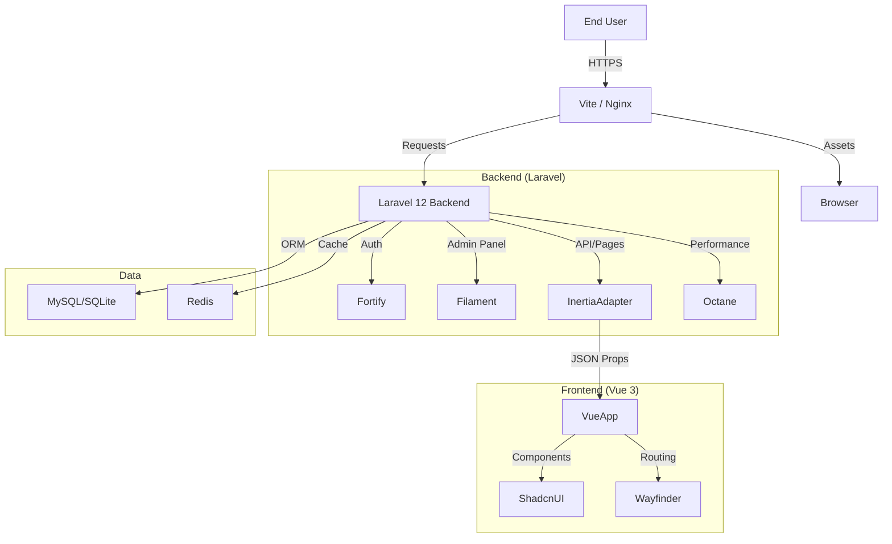

# Architecture

KoamiStarterKit follows a **Monolithic** architecture that leverages the best of server-side stability and client-side interactivity.

## High-Level Design

## Main Modules

### 1. User Application (Inertia + Vue)

- Handles the primary user interface.
- Renders pages via Inertia.js, avoiding the complexity of a separate API.
- Uses **Shadcn Vue** for accessible, customizable UI components.

### 2. Admin Panel (Filament)

- Handles back-office operations (User management, content administration).
- Built on Livewire, completely separate from the Vue frontend but sharing the same database and auth system.

### 3. Authentication & Security (Fortify + Spatie)

- **Fortify** handles headless authentication logic.
- **Spatie Permissions** manages Roles (Admin vs. User) and Permissions.
- **Impersonation**: A bridge module allowing Admins to securely "login as" users to debug issues.
